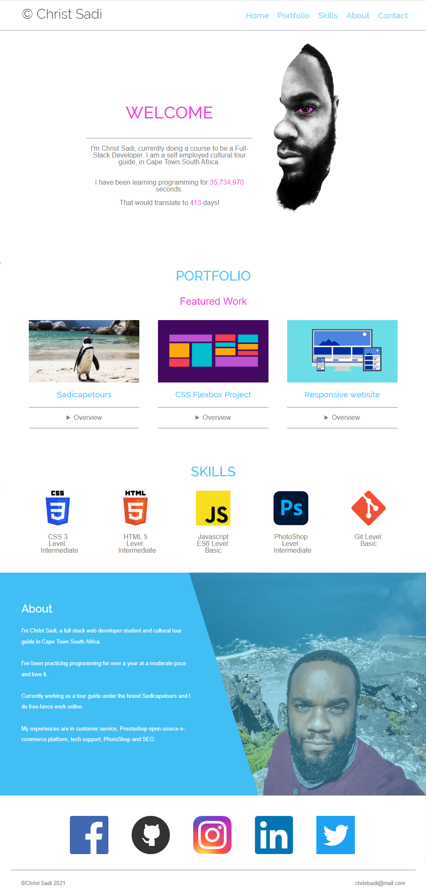

# Codecademy Challenge Project: Responsive Club Website

In this project, I built a personal portfolio website to share my personal work and the work I have built in the Full Stack Path. Portfolio from Codecademy.

## Table of Contents

- [Licence](#licence)
- [General Info](#general-information)
- [Technologies Used](#technologies-used)
- [Screenshots](#screenshots)
- [Setup](#setup)
- [Project Status](#project-status)
- [Acknowledgements](#acknowledgements)
- [Contact](#contact)

<!-- * [License](#license) -->

## Licence

This project is open source. Personal logos and images should not be used without authorization (personal brand of Christ Sadi).

## General Information

- This is a Codecademy project written in basic HTML 5, CSS 3, and basic javascript syntaxes. This is a personal portfolio website to share projects I built through my course.
- Project Objectives:
  - Build a website using HTML, CSS
  - Add interactive feature using JS
  - Use Git version control
  - Use the command line and file navigation
  - Develop locally
  - Deploy sites using GitHub Pages
  <!-- You don't have to answer all the questions - just the ones relevant to your project. -->

## Technologies Used

- VSCode - version 1.60.2
- Google Chrome (browser)
- Git and GitHub

## Screenshots

(./assets/img/contact-page-screenshot.png)

## Setup

To navigate to the website use the following link:
<https://christsadi.github.io/Portfolio-Website/>

You will find the files on this repository.

## Project Status

I will revisit and add more to this project as i progress in my course.

## Acknowledgements

- This project was based on <https://www.codecademy.com/paths/full-stack-engineer-career-path/tracks/fecp-html-css-and-js-portfolio-project/modules/fecp-personal-portfolio-website/kanban_projects/portfolio-website>.

- Many thanks to codecademy for this exposure.
- Many thanks to... Google & StackOverflow.

## Contact

Created by [@Christ Sadi) - feel free to contact me!
